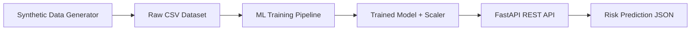
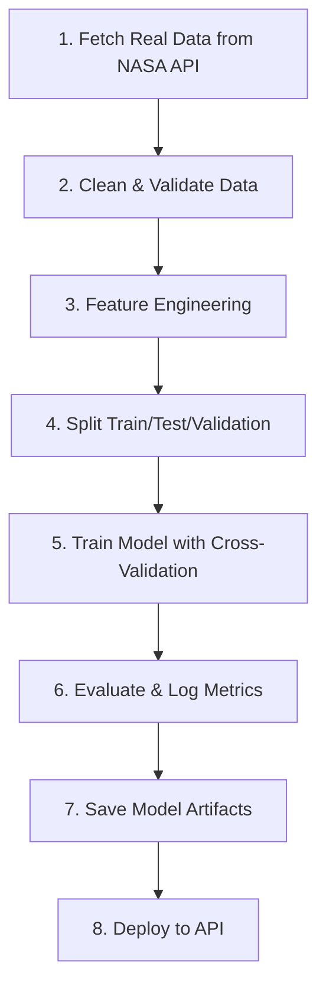

# 🚀 AI-NEO Asteroid Risk Analysis - Comprehensive Project Analysis

## 📊 Project Overview

This is an **ML-powered Near-Earth Object (NEO) Risk Prediction System** that predicts asteroid collision risk using machine learning. The project consists of three core components:

| Component | File | Purpose |
|-----------|------|---------|
| Data Generation | `generate_data.py` | Creates synthetic asteroid dataset (10,000 samples) |
| ML Training | `train_model.py` | Trains RandomForest classifier for risk prediction |
| REST API | `main.py` | FastAPI-based prediction endpoint |

### Current Architecture


### Input Features
| Feature | Range | Description |
|---------|-------|-------------|
| `distance_km` | 50,000 - 10,000,000 km | Distance from Earth |
| `velocity_kms` | 5 - 40 km/s | Asteroid velocity |
| `diameter_m` | 5 - 1,000 m | Asteroid diameter |
| `trajectory_angle_deg` | 0° - 90° | 0° = direct hit, 90° = tangential |

### Output
- **Risk Level**: Low, Medium, or High
- **Impact Probability**: 0.0 - 1.0

---

# 🔧 10 SOLID IMPROVEMENTS

## 1. **Real NASA Data Integration**
**Current State**: Uses synthetic randomly generated data  
**Improvement**: Integrate with NASA's NEO API (api.nasa.gov) to fetch real asteroid data

```python
# Proposed Enhancement
import requests

def fetch_neo_data(api_key, start_date, end_date):
    url = f"https://api.nasa.gov/neo/rest/v1/feed"
    params = {
        "start_date": start_date,
        "end_date": end_date,
        "api_key": api_key
    }
    response = requests.get(url, params=params)
    return response.json()
```

**Impact**: Transforms the project from a demo to a production-ready tool with real-world applicability.

---

## 2. **Environment Configuration & Secrets Management**
**Current State**: Hardcoded paths like `../model/risk_model.pkl`  
**Improvement**: Use environment variables and `.env` files

```python
# Proposed Enhancement
from pathlib import Path
from dotenv import load_dotenv
import os

load_dotenv()

MODEL_PATH = Path(os.getenv("MODEL_PATH", "./models/risk_model.pkl"))
SCALER_PATH = Path(os.getenv("SCALER_PATH", "./models/scaler.pkl"))
NASA_API_KEY = os.getenv("NASA_API_KEY")
```

**Impact**: Professional deployment-ready configuration, easier CI/CD integration.

---

## 3. **Comprehensive Error Handling & Validation**
**Current State**: No input validation, no error handling for model loading failures  
**Improvement**: Add Pydantic validators, try-catch blocks, and custom exceptions

```python
# Proposed Enhancement
from pydantic import BaseModel, Field, validator

class AsteroidInput(BaseModel):
    distance_km: float = Field(..., gt=0, le=4e8, description="Distance must be positive and <= Moon's distance")
    velocity_kms: float = Field(..., gt=0, le=72, description="Max possible asteroid velocity ~72 km/s")
    diameter_m: float = Field(..., gt=0, le=1000000, description="Ceres is ~940km diameter")
    trajectory_angle_deg: float = Field(..., ge=0, le=90)
    
    @validator('distance_km')
    def validate_distance(cls, v):
        if v < 100:
            raise ValueError('Object too close - would be in atmosphere')
        return v
```

**Impact**: Prevents crashes, provides meaningful error messages, improves API reliability.

---

## 4. **Model Versioning & MLOps Pipeline**
**Current State**: Single model file with no versioning  
**Improvement**: Implement MLflow or DVC for model versioning and experiment tracking

```python
# Proposed Enhancement with MLflow
import mlflow
import mlflow.sklearn

with mlflow.start_run():
    mlflow.log_param("n_estimators", 200)
    mlflow.log_param("max_depth", 10)
    mlflow.log_metric("accuracy", accuracy)
    mlflow.sklearn.log_model(model, "risk_model")
```

**Impact**: Enables A/B testing, model rollback, experiment comparison, and reproducibility.

---

## 5. **Advanced ML Model Improvements**
**Current State**: Basic RandomForest with fixed hyperparameters  
**Improvement**: 
- Hyperparameter tuning with GridSearchCV/Optuna
- Cross-validation
- Ensemble methods (XGBoost, LightGBM)
- Feature importance analysis

```python
# Proposed Enhancement
from sklearn.model_selection import GridSearchCV

param_grid = {
    'n_estimators': [100, 200, 500],
    'max_depth': [5, 10, 20, None],
    'min_samples_split': [2, 5, 10],
    'class_weight': ['balanced', None]
}

grid_search = GridSearchCV(
    RandomForestClassifier(random_state=42),
    param_grid,
    cv=5,
    scoring='f1_weighted',
    n_jobs=-1
)
```

**Impact**: Better model performance, reduced overfitting, optimal hyperparameters.

---

## 6. **Logging & Monitoring System**
**Current State**: Only print statements  
**Improvement**: Implement structured logging with Python's logging module + Prometheus metrics

```python
# Proposed Enhancement
import logging
from prometheus_client import Counter, Histogram

logging.basicConfig(
    level=logging.INFO,
    format='%(asctime)s - %(name)s - %(levelname)s - %(message)s',
    handlers=[
        logging.FileHandler('neo_api.log'),
        logging.StreamHandler()
    ]
)

PREDICTION_COUNTER = Counter('predictions_total', 'Total predictions', ['risk_level'])
PREDICTION_LATENCY = Histogram('prediction_duration_seconds', 'Time spent processing prediction')
```

**Impact**: Production observability, debugging capability, performance monitoring.

---

## 7. **Database Integration for Predictions History**
**Current State**: No persistence of predictions  
**Improvement**: Add PostgreSQL/SQLite for storing prediction history and analytics

```python
# Proposed Enhancement
from sqlalchemy import create_engine, Column, Integer, Float, String, DateTime
from sqlalchemy.orm import declarative_base, sessionmaker

Base = declarative_base()

class PredictionRecord(Base):
    __tablename__ = 'predictions'
    id = Column(Integer, primary_key=True)
    timestamp = Column(DateTime, default=datetime.utcnow)
    distance_km = Column(Float)
    velocity_kms = Column(Float)
    diameter_m = Column(Float)
    trajectory_angle_deg = Column(Float)
    risk_level = Column(String)
    impact_probability = Column(Float)
```

**Impact**: Historical analysis, trend tracking, API analytics, audit trail.

---

## 8. **API Authentication & Rate Limiting**
**Current State**: Open API with no authentication  
**Improvement**: Add JWT authentication, API keys, and rate limiting

```python
# Proposed Enhancement
from fastapi import Depends, HTTPException, Security
from fastapi.security import HTTPBearer, HTTPAuthorizationCredentials
from slowapi import Limiter

limiter = Limiter(key_func=get_remote_address)
security = HTTPBearer()

@app.post("/predict")
@limiter.limit("100/minute")
async def predict_risk(
    data: AsteroidInput,
    credentials: HTTPAuthorizationCredentials = Security(security)
):
    token = credentials.credentials
    if not verify_jwt_token(token):
        raise HTTPException(status_code=401, detail="Invalid token")
    # ... prediction logic
```

**Impact**: Security, abuse prevention, usage tracking, monetization capability.

---

## 9. **Unit & Integration Testing Suite**
**Current State**: No tests  
**Improvement**: Comprehensive pytest suite with fixtures and mocking

```python
# Proposed Enhancement - tests/test_api.py
import pytest
from fastapi.testclient import TestClient
from src.api.main import app

client = TestClient(app)

class TestPredictionAPI:
    def test_predict_low_risk(self):
        response = client.post("/predict", json={
            "distance_km": 9000000,
            "velocity_kms": 5,
            "diameter_m": 10,
            "trajectory_angle_deg": 85
        })
        assert response.status_code == 200
        assert response.json()["risk_level"] == "Low"
    
    def test_predict_high_risk(self):
        response = client.post("/predict", json={
            "distance_km": 50000,
            "velocity_kms": 40,
            "diameter_m": 900,
            "trajectory_angle_deg": 5
        })
        assert response.status_code == 200
        assert response.json()["risk_level"] == "High"
```

**Impact**: Confidence in deployments, regression prevention, CI/CD enablement.

---

## 10. **Docker Containerization & CI/CD**
**Current State**: No containerization  
**Improvement**: Dockerize the application with multi-stage builds

```dockerfile
# Proposed Enhancement - Dockerfile
FROM python:3.11-slim as builder
WORKDIR /app
COPY requirements.txt .
RUN pip install --no-cache-dir -r requirements.txt

FROM python:3.11-slim
WORKDIR /app
COPY --from=builder /usr/local/lib/python3.11/site-packages /usr/local/lib/python3.11/site-packages
COPY src/ ./src/
COPY models/ ./models/
EXPOSE 8000
CMD ["uvicorn", "src.api.main:app", "--host", "0.0.0.0", "--port", "8000"]
```

**Impact**: Consistent environments, easy deployment, scalability, cloud-ready.

---

# ✨ 10 NEW FEATURES

## 1. **Live Asteroid Tracking Dashboard**
Real-time visualization of near-Earth asteroids using NASA's Close Approach API with live risk assessments and orbit visualizations.

**Tech Stack**: WebSocket feed, Three.js for 3D orbit rendering, React for dashboard

---

## 2. **Batch Prediction API**
Process multiple asteroids simultaneously for telescope observation data import.

```python
@app.post("/predict/batch")
async def predict_batch(asteroids: List[AsteroidInput]) -> List[PredictionResponse]:
    return [predict_single(asteroid) for asteroid in asteroids]
```

---

## 3. **Alert & Notification System**
Automated alerts via email/SMS/webhook when high-risk objects are detected.

```python
class AlertConfig(BaseModel):
    threshold: str = "High"  # Low, Medium, High
    channels: List[str]  # ["email", "sms", "webhook"]
    recipients: List[str]
```

---

## 4. **Uncertainty Quantification**
Add confidence intervals and model uncertainty metrics to predictions.

```python
# Using ensemble disagreement for uncertainty
predictions = [tree.predict(input_scaled) for tree in model.estimators_]
uncertainty = np.std([p for p in predictions])
```

---

## 5. **What-If Scenario Simulator**
Interactive tool to modify asteroid parameters and see how risk changes in real-time.

---

## 6. **Historical Impact Analysis**
Database of known past impacts (Chelyabinsk, Tunguska, Chicxulub) with feature comparison.

---

## 7. **API Comparison Mode**
Compare predictions with NASA's Sentry system for validation and calibration.

---

## 8. **Mitigation Strategy Recommendations**
Based on asteroid characteristics, suggest deflection methods (kinetic impactor, gravity tractor, nuclear).

```python
def recommend_mitigation(diameter_m: float, time_to_impact_days: float):
    if time_to_impact_days > 3650 and diameter_m < 300:
        return "Kinetic Impactor (DART-style)"
    elif time_to_impact_days > 1825:
        return "Gravity Tractor"
    else:
        return "Nuclear Standoff Detonation"
```

---

## 9. **Multi-Model Ensemble Predictions**
Combine RandomForest, XGBoost, and Neural Network predictions with weighted voting.

---

## 10. **Natural Language Query Interface**
Ask questions like "What's the biggest threat this week?" using LLM integration.

---

# 🎨 10 UI DESIGN RECOMMENDATIONS

## 1. **Mission Control Dashboard**
Dark theme with glowing accents, real-time data feeds, and NASA-inspired aesthetics.

**Color Palette**:
- Primary: `#0A1628` (Deep Space Blue)
- Accent: `#00D4FF` (Cyan Glow)
- Danger: `#FF3366` (Alert Red)
- Warning: `#FFB800` (Caution Amber)

---

## 2. **3D Earth Visualization with Asteroid Orbits**
Interactive Three.js globe showing asteroid trajectories in real-time.

---

## 3. **Risk Heat Map**
Calendar-style view showing risk levels for upcoming asteroid approaches.

---

## 4. **Animated Risk Gauge**
Circular gauge that animates to show current risk level with pulsing effects for high-risk.

```css
.risk-gauge {
  background: conic-gradient(
    #22c55e 0% 35%,    /* Low - Green */
    #eab308 35% 65%,   /* Medium - Yellow */
    #ef4444 65% 100%   /* High - Red */
  );
}
```

---

## 5. **Asteroid Info Cards**
Glassmorphism cards with hover effects showing asteroid details.

```css
.asteroid-card {
  background: rgba(255, 255, 255, 0.05);
  backdrop-filter: blur(10px);
  border: 1px solid rgba(255, 255, 255, 0.1);
  border-radius: 16px;
  transition: transform 0.3s ease, box-shadow 0.3s ease;
}

.asteroid-card:hover {
  transform: translateY(-4px);
  box-shadow: 0 20px 40px rgba(0, 212, 255, 0.2);
}
```

---

## 6. **Prediction Input Form**
Sleek form with real-time validation, range sliders, and visual feedback.

---

## 7. **Notification Toast System**
Animated notifications for predictions, alerts, and system status.

---

## 8. **Responsive Mobile Design**
Mobile-first approach with swipeable cards and bottom navigation.

---

## 9. **Data Visualization Charts**
Interactive charts (Chart.js/D3.js) for:
- Risk distribution pie chart
- Time series of close approaches
- Feature importance bar chart
- Confusion matrix heatmap

---

## 10. **Onboarding Tutorial**
Guided tour for first-time users explaining the system and how to interpret results.

---

# 📋 10 WORKING PROCEDURE IMPROVEMENTS

## 1. **Project Setup & Dependencies**
```bash
# Create virtual environment
python -m venv venv
source venv/bin/activate  # Windows: venv\Scripts\activate

# Install dependencies
pip install -r requirements.txt

# Create .env file
cp .env.example .env
```

**Add `requirements.txt`**:
```
fastapi==0.109.0
uvicorn==0.27.0
numpy==1.26.3
pandas==2.1.4
scikit-learn==1.4.0
joblib==1.3.2
python-dotenv==1.0.0
pydantic==2.5.3
```

---

## 2. **Data Pipeline Workflow**


---

## 3. **Model Training Procedure**
1. **Data Preparation**: Run `generate_data.py` or fetch from NASA
2. **Training**: Execute `python train_model.py`
3. **Validation**: Review classification report
4. **Artifact Storage**: Models saved to `models/` directory
5. **Version Control**: Tag model version in MLflow

---

## 4. **API Development Workflow**
1. Start development server: `uvicorn src.api.main:app --reload`
2. Access Swagger UI: `http://localhost:8000/docs`
3. Test endpoints with curl or Postman
4. Run pytest suite before commits

---

## 5. **Git Workflow**
```bash
# Feature branch workflow
git checkout -b feature/add-nasa-integration
git add .
git commit -m "feat: integrate NASA NEO API"
git push origin feature/add-nasa-integration
# Create Pull Request for review
```

---

## 6. **Testing Procedure**
```bash
# Run all tests
pytest tests/ -v --cov=src --cov-report=html

# Run specific test file
pytest tests/test_api.py -v

# Run with coverage threshold
pytest --cov=src --cov-fail-under=80
```

---

## 7. **Deployment Procedure**
```bash
# Build Docker image
docker build -t neo-risk-api:v1.0 .

# Run container
docker run -d -p 8000:8000 --env-file .env neo-risk-api:v1.0

# Health check
curl http://localhost:8000/health
```

---

## 8. **Monitoring & Maintenance**
- Check logs: `docker logs <container_id>`
- Monitor metrics dashboard (Grafana)
- Weekly model performance review
- Monthly data refresh from NASA

---

## 9. **Documentation Standards**
- All functions must have docstrings
- API endpoints documented via OpenAPI (auto-generated by FastAPI)
- README updated with each feature
- CHANGELOG maintained for releases

---

## 10. **Code Review Checklist**
- [ ] All tests passing
- [ ] Code formatted with Black
- [ ] Type hints added
- [ ] Docstrings present
- [ ] No hardcoded values
- [ ] Error handling implemented
- [ ] Security review passed
- [ ] Performance benchmarked

---

# 📁 Recommended Project Structure

```
Ai-Neo-asteroid-risk-analysis/
├── .github/
│   └── workflows/
│       └── ci.yml              # GitHub Actions CI/CD
├── src/
│   ├── api/
│   │   ├── __init__.py
│   │   ├── main.py             # FastAPI application
│   │   ├── routes/
│   │   │   ├── predictions.py
│   │   │   └── health.py
│   │   └── middleware/
│   │       ├── auth.py
│   │       └── rate_limit.py
│   ├── data/
│   │   ├── __init__.py
│   │   ├── generate_data.py
│   │   └── nasa_client.py      # NASA API integration
│   ├── model/
│   │   ├── __init__.py
│   │   ├── train_model.py
│   │   └── predict.py
│   └── utils/
│       ├── config.py
│       └── logging.py
├── tests/
│   ├── test_api.py
│   ├── test_model.py
│   └── conftest.py
├── models/                      # Trained model artifacts
│   ├── risk_model.pkl
│   └── scaler.pkl
├── data/
│   └── raw/
│       └── asteroid_raw.csv
├── frontend/                    # React/Next.js dashboard
├── .env.example
├── .gitignore
├── Dockerfile
├── docker-compose.yml
├── requirements.txt
├── pytest.ini
└── README.md
```

---

## Summary

| Category | Current State | Recommended State |
|----------|---------------|-------------------|
| Data | Synthetic only | NASA API + synthetic |
| Model | Basic RF | Ensemble + hypertuning |
| API | No auth/validation | Full security suite |
| Testing | None | 80%+ coverage |
| Deployment | Manual | Docker + CI/CD |
| UI | None | Full dashboard |
| Monitoring | Print statements | Prometheus + Grafana |
